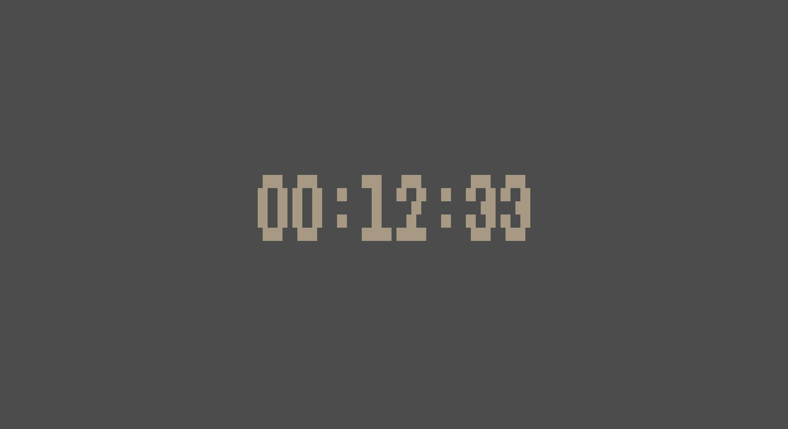

# smol terminal timer

a smol, quick timer written in [kc](https://github.com/bingis-khan/kkc).
counts time in 'HH:MM:SS' format and autoscales based on terminal size.

## options

run with `-p` to automatically load or save the timer. to reset, just remove the `timer-start` file.

or you pass a timestamp to the program to start from it (the timer prints it at exit).
